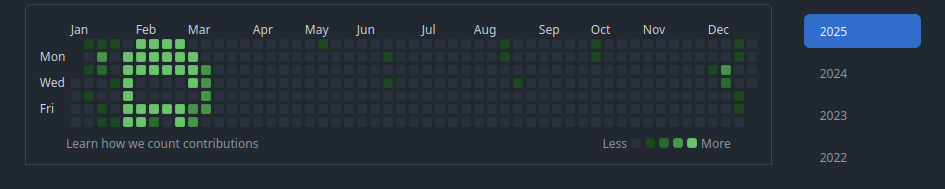

###  Olá! Sou a Isabella SMA e seja bem vinda(o) ao meu repositório dedicado ao jogo Among Us.

  

 

#

<h3 align="center">Sobre o projeto </h3> 

ඞඞඞඞඞඞඞඞඞඞඞඞඞඞඞඞඞඞඞඞඞඞඞඞඞඞඞඞඞඞඞඞඞඞඞඞඞඞඞඞඞඞඞඞඞඞඞඞඞඞඞඞඞඞඞඞඞඞඞඞඞඞඞඞඞඞඞඞඞඞඞඞ

#

 

A ideia é fazer com que os pontos de meus commits deste repositório façam a imagem do personagem do jogo Among Us. O projeto levará 29 dias e eu usarei como base de informações do jogo [este wiki feito por fans do jogo](https://among-us.fandom.com/wiki/Among_Us_Wiki) para compor os stats de meus commits.Juntamente da experiência de refletir a imagem do personagem, vou descobrir o limite de palavras que um arquivo README suporta, caso a quantidade de informações estrapole do limite, adicionarei mais outros neste repositório e darei continuidade aos arquivos anexados. 

 

#

<h3 align="center"> Planejamento </h3>

ඞඞඞඞඞඞඞඞඞඞඞඞඞඞඞඞඞඞඞඞඞඞඞඞඞඞඞඞඞඞඞඞඞඞඞඞඞඞඞඞඞඞඞඞඞඞඞඞඞඞඞඞඞඞඞඞඞඞඞඞඞඞඞඞඞඞඞඞඞඞඞඞ
 

# 

Antes de começar o projeto, analisei a grade de commit do Github e ao concluir que é possivel "desenhar" no mesmo,  comecei a planejar o processo.
Em um caderno, desenhei a grade e os respectivos commits, assim como ao lado do desenho planejei a quantidade de dias que levaria (29 dias contados)  

   

 

Ao longo que os dias passavam e os commits eram feitos, eu pintava os quadradinhos. Houve dias em que não pude manter a sequencia, e estes dias não eram esquecidos ,mas também contabilizados .  

   

 

#

### Resultados:

ඞඞඞඞඞඞඞඞඞඞඞඞඞඞඞඞඞඞඞඞඞඞඞඞඞඞඞඞඞඞඞඞඞඞඞඞඞඞඞඞඞඞඞඞඞඞඞඞඞඞඞඞඞඞඞඞඞඞඞඞඞඞඞඞඞඞඞඞඞඞඞඞ

# 

Após dias de constância e modificação de arquivos, o projeto finalmente foi conluido, e o que estava planejado no caderno finalmente era visível:  

  

E fico satisfeita ao saber que mesmo que os anos passem, é possivel rever esta imagem onde e quando quiser, basta acessar o ano de 2024. 

  

 

#

### 2025:
ඞඞඞඞඞඞඞඞඞඞඞඞඞඞඞඞඞඞඞඞඞඞඞඞඞඞඞඞඞඞඞඞඞඞඞඞඞඞඞඞඞඞඞඞඞඞඞඞඞඞඞඞඞඞඞඞඞඞඞඞඞඞඞ

# 

Com a alegria e satisfação de ter concluído este projeto, decidi fazer o mesmo no ano de 2025 da mesma forma feita como antes porém apenas um pequeno detalhe foi adicionado: ao invés de focar apenas no entretenimento (falar sobre o jogo novamente), resolvi aprender enquanto me divirto e com isso, estou estudando conceitos de programação que possuo dificuldade/ainda sou iniciante. Dessa forma, ao longo que atualizo e crio meus repositórios com novos aprendizados, meus commits estarão fazendo a imagem do personagem de Among Us 

#

2026

0
1
2
3
